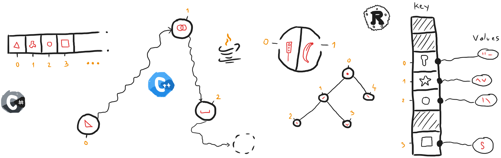
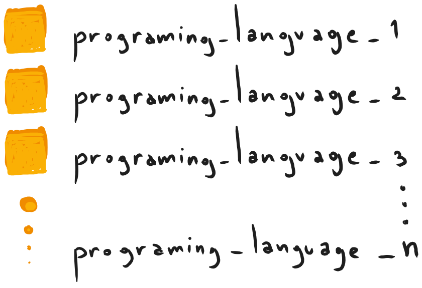
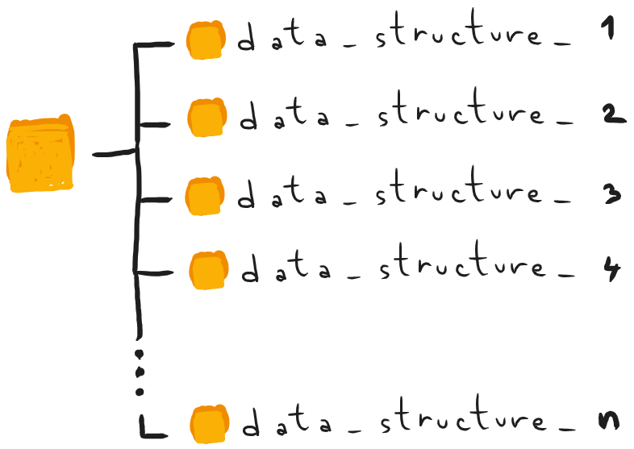
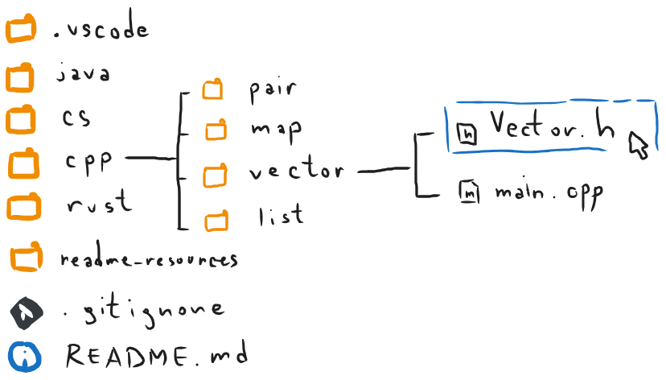

# Data structures implementations

This repository will contain implementations of different data structures, in some programming languages.

## The repository's structure

The directory structure will be organized in such manner that each programming language has it's own folder.

Inside each such folder, there will be another collection of folders that will have the name of different data structures.

And this is an example of how can you find an implementation in this repository. Let say that we want the vector in C++.

